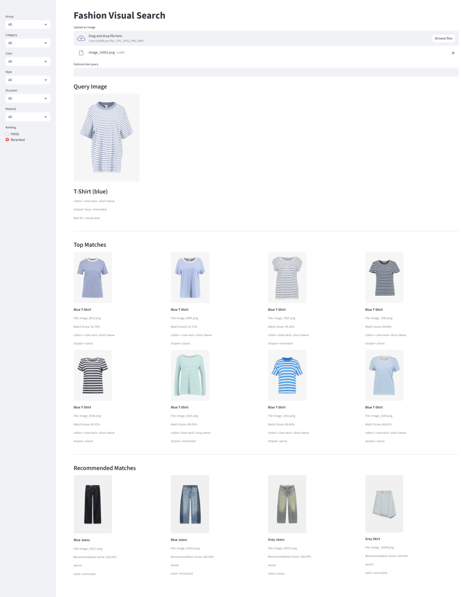
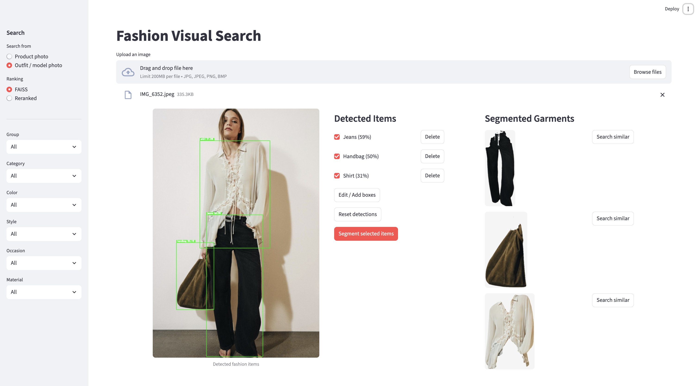
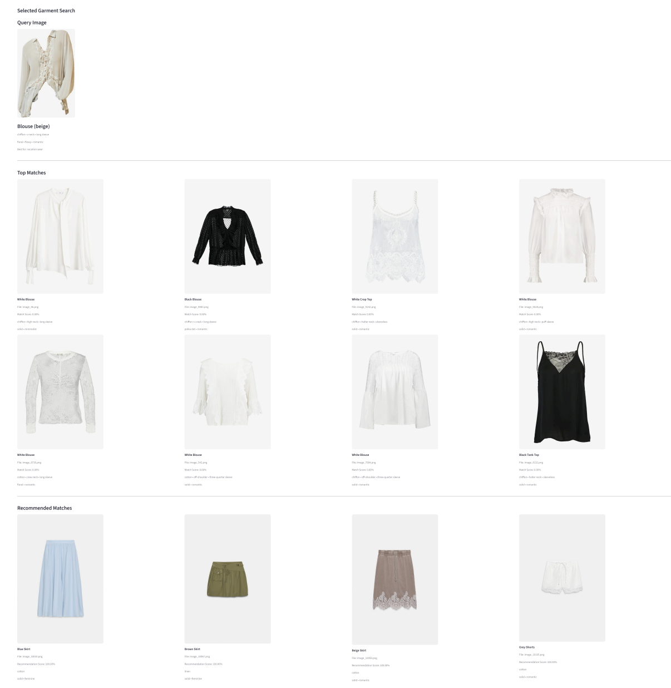

# Fashion Visual Search

Fashion Visual Search is a local multimodal retrieval application for finding visually or semantically similar garments in a catalog of 10,424 indexed images. It uses a SigLIP2 image/text encoder, exact FAISS search for image queries, direct embedding similarity for text queries, zero-shot metadata extraction, and optional metadata-aware reranking. The v2 Streamlit interface supports product-photo, text, combined image-plus-text, and human-reviewed outfit/model-photo search.

## Demo

The Streamlit application supports:
- Image-to-image retrieval
- Text-to-image retrieval
- Combined image-text search
- Outfit/model-photo garment detection and segmentation
- Human-in-the-loop detection and bounding-box review
- Metadata-aware reranking
- Complementary item recommendations







## Key features

- Image-to-image search over normalized 1,536-dimensional embeddings.
- Text-to-image search in the same SigLIP2 embedding space.
- Combined image-and-text search, with text similarity applied to image-retrieved candidates.
- Grounding DINO candidate detection for garments and fashion accessories in outfit/model photos.
- Interactive checkbox visibility, deletion/reset controls, and manual bounding-box editing or addition with stable detection IDs.
- Category-aware non-maximum suppression and SAM2 box-prompted segmentation on user-approved detections.
- Isolated-garment search on a light gray catalog-style background through the existing SigLIP2/FAISS pipeline.
- Exact `IndexFlatIP` FAISS retrieval; normalized image vectors make inner product equivalent to cosine similarity.
- Zero-shot category and attribute prediction for category, material, neckline, occasion, pattern, sleeve, structure, style, and garment details.
- Foreground-aware primary/secondary color extraction and color-distribution comparison.
- Metadata-aware reranking and sidebar filters for group, category, color, style, occasion, and material.
- Complementary-item recommendations based on group, color, style, occasion, and pattern rules.
- Committed quality and latency evaluation outputs.

## Architecture and retrieval pipeline

```text
Image query                                      Text query
    |                                                |
SigLIP2 image encoder                         SigLIP2 text encoder
    |                                                |
L2-normalized query vector                    L2-normalized query vector
    |                                                |
FAISS IndexFlatIP search (top 50)             Matrix similarity against all
    |                                         stored embeddings (top 12 in UI)
    |                                                |
Attach aligned catalog metadata               Attach aligned catalog metadata
    |
Extract query category, attributes, and foreground colors
    |
Metadata-aware reranking of image candidates
    |
Optional metadata filters -> up to 20 displayed matches
```

For a combined query, the image vector first retrieves 50 FAISS candidates. Text similarity is then calculated only for those candidates. The reranker combines image similarity, text similarity, category/group agreement, and foreground-color overlap.

The v2 outfit/model-photo workflow adds a human-reviewed extraction stage before the existing retrieval pipeline:

```text
Outfit image
    |
Grounding DINO garment detection and coarse labels
    |
User review: hide/show, delete/reset, or correct/add bounding boxes
    |
SAM2 box-prompted segmentation
    |
Isolated garment on a light gray catalog-style background
    |
SigLIP2 embedding and zero-shot metadata generation
    |
FAISS retrieval
    |
Metadata-aware reranking and complementary recommendations
```

Grounding DINO locates candidate fashion items and supplies a coarse detection label. SAM2 isolates each approved garment from the outfit image. The Grounding DINO label is not treated as final retrieval metadata: the downstream SigLIP2 zero-shot metadata pipeline classifies the isolated garment and determines its retrieval category and attributes. The review step is intentional, allowing users to correct missed, imprecise, or unwanted detections before segmentation.

The model configured in `config.py` is `hf-hub:timm/ViT-gopt-16-SigLIP2-384`, loaded through `open_clip`. The current local artifact bundle contains catalog vectors with shape `(10424, 1536)` and dtype `float32`; its FAISS artifact is an `IndexFlatIP` containing 10,424 vectors of dimension 1,536. These generated artifacts are intentionally excluded from normal Git tracking.

## Repository structure

```text
.
├── api/
│   ├── retrievalEngine.py        # model loading and image/text retrieval
│   ├── segment.py                # Grounding DINO detection and SAM2 segmentation
│   ├── searchReranker.py         # metadata-aware scoring
│   ├── zeroShotClassifier.py     # category and attribute prediction
│   └── recommendationEngine.py   # complementary-item rules
├── artifacts/README.md           # aligned artifact manifest and safety notes
├── dataset/
│   ├── data/                     # upstream Parquet shards
│   ├── extracted_images/         # indexed catalog images
│   ├── evaluation_images/        # evaluation query images
│   ├── extracted_captions/       # extracted captions
│   └── extractor.py
├── embeddings/
│   ├── embeddings.npy            # generated locally; ignored by Git
│   ├── image_paths.pkl           # generated locally; ignored by Git
│   ├── metadata.pkl              # generated locally; ignored by Git
│   ├── extractEmbedding.py
│   └── buildMetadata.py
├── evaluation/
│   ├── judgments.csv             # manual graded judgments
│   ├── metrics_summary.csv       # aggregate retrieval metrics
│   ├── metrics_per_query.csv     # query-level metrics
│   ├── latency_results.csv       # 1,000 per-query measurements
│   ├── latency_summary.csv       # aggregate latency statistics
│   ├── evaluate_metrics.py
│   └── evaluate_latency.py
├── docs/evaluation/
│   └── groundedsam_v2_summary.md # aggregate outfit-pipeline evaluation
├── index/
│   ├── faiss.index               # generated locally; ignored by Git
│   └── build_index.py
├── ui/app.py                     # Streamlit application
├── config.py                     # paths, model identifier, labels, and rules
└── requirements.txt
```

## Installation

Clone the source code using the repository's normal GitHub clone URL. The clone contains the source, documentation, and committed evaluation files, but it does not redistribute source datasets, catalog/evaluation images, captions, model weights, or the generated retrieval artifacts.

No Python version is declared in the repository. In a compatible Python environment, install the declared dependency list. The Streamlit, `streamlit-label-kit`, Transformers, PyTorch, OpenCV, and Pillow versions are pinned to the tested v2 environment, including the bounding-box editor compatibility adapter:

```sh
python -m venv .venv
source .venv/bin/activate
python -m pip install --upgrade pip
python -m pip install -r requirements.txt
```

The first model-backed run may need to obtain the configured SigLIP2, Grounding DINO, and SAM2 Hugging Face model weights. `pyarrow` is included for the documented `pandas.read_parquet` extraction path.

Users must obtain the required source data and images independently under the applicable upstream terms. The repository currently provides no hosted artifact download URL. To run retrieval, users must either generate the four-file artifact bundle locally or obtain the complete aligned bundle separately from a trusted source. In either case, these files and the catalog images referenced by `embeddings/image_paths.pkl` must be present:

- `embeddings/embeddings.npy`
- `embeddings/image_paths.pkl`
- `embeddings/metadata.pkl`
- `index/faiss.index`

Do not combine artifacts produced by different generation runs. See [artifacts/README.md](artifacts/README.md) for the current local bundle manifest and validation requirements.

### Generate the local data and artifact bundle

After independently obtaining the upstream Parquet shards, place them in `dataset/data/`. Extract their images and captions with:

```sh
python dataset/extractor.py --mode both
```

If additional independently sourced catalog images are required, place them in `dataset/extracted_images/` before generating embeddings. Then run the existing generation scripts in order:

```sh
python embeddings/extractEmbedding.py
python embeddings/buildMetadata.py
python index/build_index.py
```

This creates the canonical local bundle names listed above. The generated bundle may differ from the current 10,424-item local bundle unless the exact same permitted source images, model behavior, dependencies, and input ordering are used.

## Usage

Start the Streamlit application from the repository root:

```sh
.venv/bin/streamlit run ui/app.py
```

Then open the local URL printed by Streamlit (normally `http://localhost:8501`). Choose a product photo or outfit/model photo in the sidebar, then upload an image or enter a text query where available. For image-backed searches, the sidebar can switch between raw FAISS order and reranked order. Filters are applied after ranking.

### Image-to-image search

The UI preprocesses an uploaded image with the configured SigLIP2 transform, encodes and normalizes it, and retrieves 50 candidates from `IndexFlatIP`. It extracts metadata from the query, enriches candidates with aligned stored metadata, and exposes raw or reranked results. Up to 20 matches are displayed after filtering.

The underlying API can be called directly:

```python
from api.retrievalEngine import RetrievalEngine
from config import get_engine_kwargs_with_metadata

engine = RetrievalEngine(**get_engine_kwargs_with_metadata())
indices, paths, scores, query_embedding = engine.search("query.png", k=20)
```

### Text-to-image search

Text search tokenizes and encodes the query with the same model, normalizes the vector, computes its inner product against every stored embedding with NumPy, sorts the scores, and applies the engine's sigmoid score scaling. The UI and `RetrievalEngine.text_search` both support text-only retrieval.

```python
indices, paths, scores, text_embedding = engine.text_search(
    "white long-sleeve blouse",
    k=12,
)
```

When both an image and text are supplied, `multimodal_search` retrieves candidates by image first and calculates text scores within that candidate set.

### Outfit/model-photo search

Select **Outfit / model photo** and upload an image. Grounding DINO runs once for a new upload, using the vocabulary in `DETECTION_CATEGORIES`, then category-aware NMS removes overlapping candidates where appropriate. The resulting detections remain in Streamlit session state, so checkbox reruns only change which boxes are visible and selected; they do not rerun detection.

Review the candidates before segmentation. Checkboxes hide or show individual detections, **Delete** removes one detection without changing another item's selection state, **Reset detections** reruns detection, and **Edit / Add boxes** supports correcting existing boxes or drawing a box around a missed garment. Detection IDs remain stable across these interactions.

Choose **Segment selected items** to run SAM2 only on the selected boxes. Each mask is used to isolate and crop its garment on a light gray background. Select **Search similar** beside an isolated garment to run SigLIP2 embedding, zero-shot metadata generation, FAISS retrieval, metadata-aware reranking, and complementary recommendations. Detections, segmented outputs, and the selected garment search persist across normal reruns; uploading a different image resets the outfit state.

## Metadata extraction and reranking

`ZeroShotCategoryClassifier` averages normalized embeddings from prompt templates to classify catalog and query embeddings. Category labels map into `Tops`, `Bottoms`, `One-Pieces`, `Outerwear`, `Accessories`, and `Footwear`. The attribute configuration in `config.py` defines the supported material, neckline, occasion, pattern, sleeve, structure, style, and detail labels. `DETECTION_CATEGORIES` is the source of truth for Grounding DINO's detection vocabulary and broad-category mapping; `CATEGORY_MAPPING` extends it with retrieval-only labels.

Color extraction uses, in order:

1. An alpha mask when meaningful transparency is present.
2. A foreground mask based on LAB distance from the median border color, followed by morphological cleanup.
3. GrabCut only when the preceding mask contains fewer than `max(50, 0.5% of image pixels)` foreground pixels.

Foreground pixels are assigned HSV-based color labels. The stored metadata records the primary color, an optional secondary color, a multicolor flag, and the complete color distribution.

For image-only queries, the default reranker normalizes the configured image/category/color weights (`0.5/0.2/0.1`) over their sum. For combined image-and-text queries it uses `0.5` image similarity, `0.2` text similarity, `0.2` category agreement, and `0.1` color overlap. Exact category matches score `1.0`, group matches score `0.5`, and color similarity is the intersection of the two color distributions. Text-only results retain their text score.

## Evaluation methodology

The committed quality evaluation is a **manually labeled pilot benchmark**, not an exhaustive recall benchmark. It covers exactly 21 queries, `q001` through `q021`, and 597 manually graded query-product pairs in `evaluation/judgments.csv`.

For each query, `evaluation/generate_judgments.py` retrieves 50 raw FAISS candidates and forms the union of the raw top 20 and metadata-reranked top 20 for judgment. Relevance uses four grades:

- `0`: not relevant
- `1`: weakly relevant
- `2`: relevant
- `3`: highly relevant

Grades greater than or equal to `2` are relevant for binary metrics. `evaluation/evaluate_metrics.py` evaluates both rankings to rank 20 and averages query-level results across the 21 queries. It reports Precision@1/5/10/20, Hit@1/5/10/20, MRR, and graded nDCG@5/10/20. Because judgments are limited to the evaluated candidate union and query sample, the results characterize this pilot set; they do not estimate exhaustive catalog recall or generalize automatically to other query distributions.

Run the metric calculation from the repository root:

```sh
python evaluation/evaluate_metrics.py
```

This reads `evaluation/judgments.csv` and rewrites `evaluation/metrics_per_query.csv` and `evaluation/metrics_summary.csv`.

## Evaluation results

The values below are copied from `evaluation/metrics_summary.csv` without changing its stored precision.

| Metric | Raw FAISS | Metadata-aware reranking | Delta |
|---|---:|---:|---:|
| Precision@1 | 0.9523809523809523 | 1.0 | 0.04761904761904767 |
| Precision@5 | 0.8476190476190476 | 0.9238095238095237 | 0.07619047619047614 |
| Precision@10 | 0.7904761904761906 | 0.8857142857142858 | 0.09523809523809523 |
| Precision@20 | 0.7238095238095238 | 0.7904761904761906 | 0.06666666666666676 |
| Hit@1 | 0.9523809523809523 | 1.0 | 0.04761904761904767 |
| Hit@5 | 1.0 | 1.0 | 0.0 |
| Hit@10 | 1.0 | 1.0 | 0.0 |
| Hit@20 | 1.0 | 1.0 | 0.0 |
| MRR | 0.9761904761904762 | 1.0 | 0.023809523809523836 |
| nDCG@5 | 0.6941470673575368 | 0.754333931398646 | 0.06018686404110918 |
| nDCG@10 | 0.7171694596384555 | 0.7973206828190946 | 0.08015122318063916 |
| nDCG@20 | 0.7709128454744812 | 0.8468669135666482 | 0.07595406809216698 |

### GroundedSAM v2 outfit evaluation

The v2 extraction workflow was evaluated on 32 outfit/model images containing 70 visible garments. It achieved **88.6% garment detection recall**, and **96.9% of produced masks were rated Good or Usable**. See the lightweight [GroundedSAM v2 evaluation summary](docs/evaluation/groundedsam_v2_summary.md) for aggregate counts and rating definitions; the raw working sheet and per-image remarks are not committed.

## Latency benchmark

`evaluation/evaluate_latency.py` uses the first 1,000 valid unique catalog paths in `embeddings/image_paths.pkl`. It first runs 10 warm-up queries; those warm-up executions are excluded from the recorded rows. All 1,000 measured queries in `evaluation/latency_results.csv` completed successfully.

Each measured query includes:

- **FAISS search:** image loading/preprocessing, SigLIP2 image encoding and normalization, and retrieval of 50 candidates.
- **Result enrichment:** attaching aligned stored metadata and image scores.
- **Raw pipeline:** FAISS search plus enrichment.
- **Query metadata extraction:** zero-shot category/attribute classification plus foreground and color analysis.
- **Reranking:** scoring 50 candidates and slicing the top 20.
- **Reranked pipeline:** raw pipeline plus query metadata extraction and reranking.
- **Reranking overhead:** query metadata extraction plus reranking.

These are application-level component timings from the committed run, not isolated FAISS-index timings. The repository does not record the benchmark hardware or device, so the absolute times should not be treated as portable performance claims.

The median and P95 values below are copied from `evaluation/latency_summary.csv` without changing its stored precision:

| Measurement | Median (ms) | P95 (ms) |
|---|---:|---:|
| FAISS search | 1149.6415625 | 1533.5601048 |
| Result enrichment | 0.11675 | 0.8768434499999985 |
| Raw pipeline | 1149.8647915000001 | 1534.5575819499998 |
| Query metadata extraction | 67.35691650000001 | 88.85238125 |
| Candidate reranking | 0.37289550000000005 | 0.48499934999999994 |
| Reranked pipeline | 1222.788813 | 1625.43752165 |
| Reranking overhead | 67.706583 | 89.50976845 |

The reranking overhead includes metadata extraction; candidate score sorting alone is the `Candidate reranking` row. The color extractor has a deliberately rare GrabCut fallback when alpha/LAB foreground masking is insufficient. In the committed run, `image_776.png` is the single metadata measurement above one second: it triggers GrabCut and records `22728.354709` ms for metadata extraction, making it the observed worst-case path rather than representative steady-state latency.

Run a new benchmark with:

```sh
python evaluation/evaluate_latency.py
```

This rewrites both committed latency CSVs and will reflect the current machine, device, model cache, and artifact bundle.

## Reproducibility

### Metric-level reproducibility

The published quality summary can be recomputed from the committed manual labels without running retrieval or downloading model weights:

```sh
python evaluation/evaluate_metrics.py
```

This level requires the committed `evaluation/judgments.csv`, `evaluation/evaluate_metrics.py`, and its Python dependencies. The generated summary and per-query CSVs can then be compared with the committed outputs.

### End-to-end retrieval reproducibility

Reproducing retrieval results, regenerating judgments, rebuilding metadata, or rerunning latency additionally requires:

- the catalog and query images at the paths expected by the repository;
- the model weights and preprocessing/tokenizer behavior for `hf-hub:timm/ViT-gopt-16-SigLIP2-384`;
- compatible library/runtime behavior; and
- one aligned artifact bundle containing `embeddings.npy`, `image_paths.pkl`, `metadata.pkl`, and `faiss.index`.

The four artifacts are positionally coupled and intentionally excluded from normal Git tracking. There is currently no hosted artifact download URL. Verify any separately obtained bundle against its trusted manifest, and never mix files from separate runs.

To regenerate the bundle after independently obtaining the required source data, place the Parquet shards in `dataset/data/`, then run:

```sh
python dataset/extractor.py --mode both
```

Add any other independently obtained and permitted catalog images to `dataset/extracted_images/` before continuing:

```sh
python embeddings/extractEmbedding.py
python embeddings/buildMetadata.py
python index/build_index.py
```

`dataset/extractor.py` defaults to at most 11,000 extracted records, while the current local aligned bundle contains 10,424 catalog items. Regeneration therefore depends on the exact available inputs and should be treated as a new complete artifact version, not substituted file by file.

## Dataset and model attribution

- **Dataset:** [`lirus18/deepfashion_with_captions`](https://huggingface.co/datasets/lirus18/deepfashion_with_captions), the primary dataset source used by this repository. The extractor reads the `cloth` image field and `caption` field from the Parquet shards.
- **Additional product images:** 420+ product images manually collected from Zara product pages, mainly covering bottoms, one-pieces, and outerwear to improve category coverage. These images are used for research and portfolio experimentation only and are not redistributed in this repository; users should obtain any required source images independently and comply with the original website terms and applicable rights.
- **Model:** [`timm/ViT-gopt-16-SigLIP2-384`](https://huggingface.co/timm/ViT-gopt-16-SigLIP2-384), configured as `hf-hub:timm/ViT-gopt-16-SigLIP2-384` for both model and tokenizer loading through `open_clip`.
- **Detection model:** [`IDEA-Research/grounding-dino-base`](https://huggingface.co/IDEA-Research/grounding-dino-base), used to locate candidate fashion items and provide coarse labels in outfit/model photos.
- **Segmentation model:** [`facebook/sam2.1-hiera-large`](https://huggingface.co/facebook/sam2.1-hiera-large), used for box-prompted garment masks after detection review.

Dataset files, extracted images, evaluation images, and captions remain governed by the upstream dataset terms. Model weights remain governed by their respective model terms. Nothing in this repository establishes additional redistribution permission. Review and comply with the upstream terms before distributing any dataset-derived content.

## Version history

- **v1:** SigLIP2 visual/text retrieval, FAISS search, zero-shot metadata classification, metadata-aware reranking, and complementary recommendations.
- **v2:** Grounding DINO and SAM2 outfit-garment extraction, human-in-the-loop bounding-box review, segmented-garment search, expanded fashion detection support, and the updated Streamlit UI.

## Limitations

- The quality study is a small, manually labeled pilot of 21 queries and a judged top-result union, not an exhaustive recall benchmark.
- The pilot queries do not establish performance across the full catalog, all garment groups, difficult backgrounds, or natural user-query distributions.
- Category and attribute labels are zero-shot predictions from a fixed label and prompt set, not verified product annotations.
- Grounding DINO detections and SAM2 masks can require human correction for occlusion, layering, small garments, or ambiguous boundaries.
- HSV color rules and foreground segmentation can fail on complex backgrounds, transparency, shadows, small garments, and ambiguous or multicolored items; GrabCut can add large tail latency.
- `IndexFlatIP` is exact but scans the index; latency and memory usage will grow with the catalog.
- Text-only search uses a full NumPy similarity calculation rather than the FAISS index.
- The committed latency outputs do not include hardware, operating system, model-cache, or device metadata.
- The Python version and upstream model revisions are not pinned, which limits byte-for-byte environment reproduction.

## Future work

- Expand the labeled benchmark across more queries, garment groups, backgrounds, and text intents, with a documented annotation protocol and assessor agreement.
- Add exhaustive or deeper pooled judgments before reporting recall-oriented metrics.
- Record benchmark hardware, device, software versions, model revision, and artifact version automatically.
- Pin a tested Python version and upstream model revisions.
- Add artifact-manifest validation at load time to prevent accidental cross-run mixing.
- Improve foreground/color robustness and reduce or isolate GrabCut tail latency.
- Evaluate approximate FAISS indexes and batching for larger catalogs.
- Validate zero-shot attributes and recommendation rules against human annotations.

## License

No repository license has been selected or committed. Until a license is added, no open-source permissions should be inferred. Dataset and model components remain subject to their respective upstream terms.
